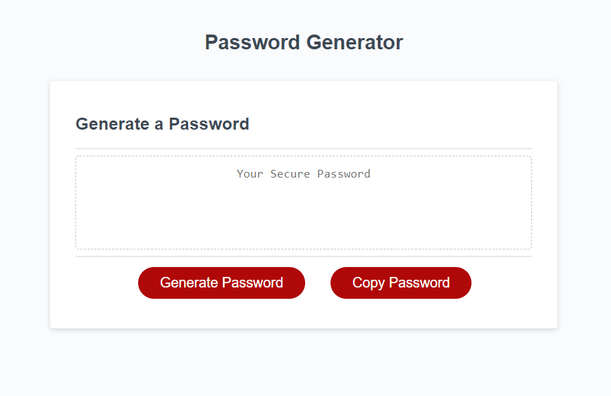

# Random Password Generator

Deployed on Github page: https://bens213.github.io/random-password-generator/

## Description

The length of the password can be chosen by the user within the range of 8 and 128 characters. Additionally, the user can specify the password parameters with the inclusion of Numbers, special character, uppercase, and/or lowercase characters. Once the password has been generated, the password can be copied to the users clipboard with the copy button. 

## language used

javascript

